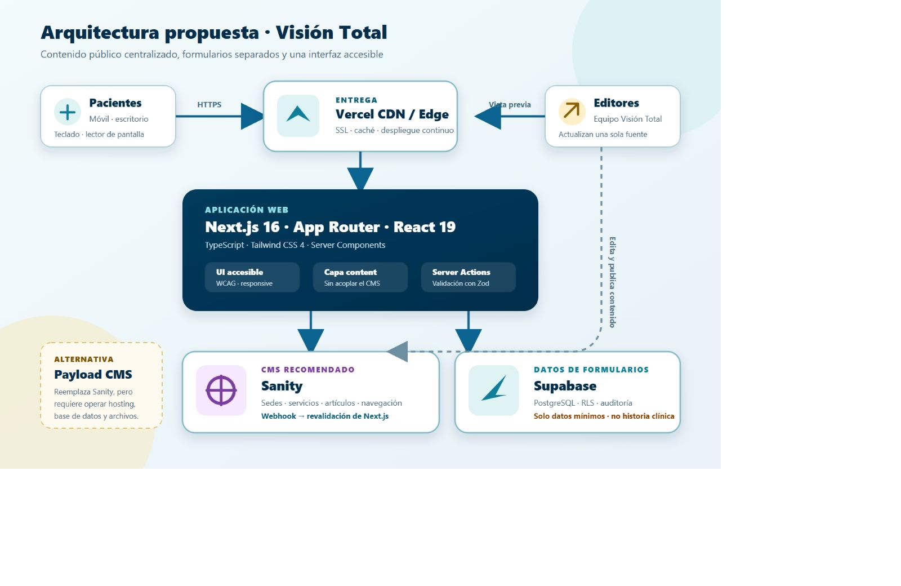

# Propuesta técnica — nueva web de Visión Total

Fecha de evaluación: 20 de agosto de 2026.

## Decisión recomendada

Construir la web con **Next.js 16 (App Router), React 19, TypeScript y Tailwind CSS 4**, usar **Sanity** para el contenido editorial público y mantener los datos de formularios fuera del CMS. Para citas, PQRSF y encuestas, la opción técnica propuesta es una capa de Server Actions/Route Handlers con validación Zod y una base PostgreSQL con controles de acceso (por ejemplo, Supabase), o la integración con el sistema institucional que ya use Visión Total.

Para este proyecto recomiendo **Sanity sobre Payload**. No porque Payload sea peor, sino porque Visión Total necesita que personal no técnico pueda actualizar sedes, servicios, campañas y prevención con poca carga operativa. Sanity entrega el backend administrado, CDN, assets y Studio; Payload exige operar también base de datos, almacenamiento, correo, copias de seguridad y despliegues. En agosto de 2026, además, Payload pausó la creación de nuevos proyectos en su antiguo Cloud tras integrarse con Figma, aunque mantiene su núcleo open source y self-hosted.

## Stack propuesto

| Capa | Tecnología | Por qué encaja |
|---|---|---|
| Framework | Next.js 16 App Router | SEO, metadata, renderizado estático/servidor, rutas y formularios en un mismo proyecto. |
| UI | React 19 + TypeScript | Ecosistema conocido por el desarrollador y contratos tipados para evitar contenido inconsistente. |
| Estilos | Tailwind CSS 4 | Desarrollo responsive rápido sin imponer un kit visual genérico. |
| Iconos | Lucide React | Iconos SVG consistentes, livianos y accesibles cuando se etiquetan correctamente. |
| CMS editorial | Sanity | Contenido administrado, imágenes, vista previa y colaboración sin operar infraestructura propia. |
| Formularios | Server Actions/Route Handlers + Zod | Validación en servidor, menor exposición y errores de datos más claros. |
| Datos privados | Supabase/PostgreSQL o sistema institucional | RLS, auditoría y separación estricta respecto del contenido público. |
| Despliegue | Vercel | Integración directa con Next.js, CDN y despliegues por Git. |
| Analítica | GTM + GA4 con consentimiento | Medición de conversiones sin mezclarla con la lógica editorial. |

Next.js documenta que App Router usa Server Components, Suspense y Server Functions: [documentación oficial](https://nextjs.org/docs/app).

## Sanity vs. Payload: comparación honesta

### Sanity

- **Free: USD 0/mes.** Incluye hasta 20 asientos, 2 datasets públicos, 10.000 documentos, 1 millón de solicitudes CDN/mes, 100 GB de assets y 100 GB de transferencia. Para la fase inicial de esta web pública es suficiente.
- **Growth: USD 15 por asiento/mes.** Añade datasets privados, más roles, comentarios/tareas, borradores programados y pago por exceso de uso.
- Ventajas: poca operación de infraestructura, Studio amigable, CDN y assets incluidos, GROQ, webhooks y previsualización.
- Desventajas: dependencia de un servicio externo; el plan Free solo permite datasets públicos y los permisos avanzados cuestan más.
- Fuente: [precios oficiales de Sanity](https://www.sanity.io/pricing).

### Payload

- **Software: USD 0.** Es open source con licencia MIT y puede autoalojarse sin pagar licencia.
- En agosto de 2026, la creación de nuevos proyectos en Payload Cloud está pausada. Los proyectos nuevos deben autoalojarse o usar las plantillas de Vercel/Cloudflare.
- El costo real no es solo la licencia: producción requiere hosting de Node/Next.js, Postgres o MongoDB, almacenamiento permanente de archivos, correo, CDN, backups, monitoreo y mantenimiento de seguridad.
- Puede arrancar en tiers gratuitos para desarrollo, pero una base comercial razonable sería Vercel Pro (USD 20/mes) más base/archivos. Si se usa Supabase Pro como base y storage, parte desde USD 25/mes. Eso deja una base orientativa de **USD 45/mes**, antes de excesos y tiempo de operación.
- Ventajas: propiedad y control total, esquemas en TypeScript, autenticación y API integradas, sin cobro por editores en el núcleo self-hosted.
- Desventajas: mayor DevOps, migraciones de base, backups, storage y superficie de seguridad bajo responsabilidad del equipo.
- Fuentes: [estado actual y despliegue de Payload](https://payloadcms.com/get-started), [requisitos de producción](https://payloadcms.com/docs/production/deployment), [anuncio sobre Payload Cloud](https://payloadcms.com/payload-has-joined-figma).

### Recomendación económica

1. **Inicio/MVP:** Sanity Free + despliegues de prueba. Costo de CMS: USD 0.
2. **Producción comercial:** Sanity Free puede seguir siendo suficiente para contenido público; Vercel Pro cuesta actualmente USD 20/mes. Se debe presupuestar dominio, correo y el sistema elegido para formularios.
3. **Datos de formularios:** Supabase Free sirve para desarrollo y pruebas, pero pausa proyectos inactivos y no incluye backups. Para producción, Supabase Pro parte de USD 25/mes e incluye backups diarios por 7 días. Fuente: [precios oficiales de Supabase](https://supabase.com/pricing).
4. **Subir a Sanity Growth** solo cuando hagan falta borradores programados, datasets privados o más roles editoriales. No pagar Growth por anticipado.

Los valores anteriores son precios de lista en USD y pueden generar impuestos o consumo adicional. Vercel publica Hobby en USD 0 y Pro en USD 20/mes: [precios oficiales](https://vercel.com/pricing). Para una clínica y un sitio comercial, no conviene diseñar el presupuesto de producción alrededor de tiers personales o servicios que se pausan.

## Regla central para evitar información duplicada

La web no debe guardar una dirección, teléfono, horario o ciudad dentro de cada página. Se modelan entidades únicas y las páginas solo las referencian:

- `siteSettings`: logo, teléfono general, correo, horario y navegación.
- `locations`: ciudad, sedes, direcciones, canales y servicios disponibles.
- `services`: nombre, resumen, imagen, requisitos y relación con sedes.
- `patientActions`: cita, PQRSF, encuesta y sus canales vigentes.
- `campaigns`: brigadas activas con fecha de inicio/fin y estado.
- `articles`: prevención, categoría, autor, revisión clínica y fecha de actualización.

Así, cambiar un teléfono o cerrar una sede se hace una vez. Los componentes consultan esas entidades, no copias de texto.

## Diagrama de arquitectura



La capa `content` desacopla los componentes de Sanity. Si en el futuro se decide migrar a Payload, se reemplaza el adaptador y no se reescribe toda la interfaz.

## Separación de contenido y datos sensibles

- **Sanity:** solo contenido público del sitio. Nunca historia clínica, síntomas, diagnósticos ni documentos de pacientes.
- **Formularios:** pedir el mínimo necesario, cifrar tránsito, aplicar RLS, retención definida, auditoría y control de acceso.
- **Citas:** preferir integración con el sistema institucional. Si la web solo solicita contacto, dejar claro que no confirma una cita automáticamente.
- **PQRSF/encuestas:** rutas y permisos independientes; no enviar detalles clínicos a analítica.
- Antes de producción se requiere revisión de la política de tratamiento de datos conforme a la Ley 1581 de 2012 y las políticas internas de la IPS.

## Accesibilidad implementada en la primera landing

- HTML semántico con un `h1`, secciones etiquetadas, `nav`, `main`, `article`, `address` y `footer`.
- Enlace “Saltar al contenido principal”.
- Navegación móvil operable con teclado.
- Foco visible de alto contraste.
- Accesibilidad integrada sin una barra adicional: contraste, tamaños legibles, zoom nativo y jerarquía visual funcionan desde la interfaz principal.
- Botones y enlaces con áreas cómodas de interacción.
- Iconos decorativos ocultos a lectores de pantalla y controles con nombre accesible.
- Texto alternativo útil en imágenes informativas y `alt=""` en imágenes decorativas.
- Respeto por `prefers-reduced-motion` y soporte para colores forzados.
- Diseño responsive probado a 390 px y en escritorio.

Esto es una base WCAG 2.2 AA, no una certificación. Antes de publicar corresponde una auditoría con axe/Lighthouse, lector de pantalla (NVDA/VoiceOver), zoom al 200/400 %, navegación solo con teclado y pruebas con pacientes reales.

## Estructura implementada

```text
vision-total-web/
├── docs/
│   ├── architecture-vision-total.svg
│   ├── architecture-vision-total.png
│   └── IMAGE_CREDITS.md
├── public/
│   ├── architecture-vision-total.svg
│   ├── architecture-vision-total.png
│   └── images/
│       ├── logo.png
│       ├── banner-fachada-vision-total-monteria.png
│       ├── pexels-eye-exam-6749763.jpg
│       ├── pexels-hero-exam-5766072.jpg
│       ├── pexels-hero-family-5621856.jpg
│       ├── resource-about-1.jpg
│       ├── service-service-1.jpg
│       └── news-news-{1,2,3}.jpg
├── src/
│   ├── app/
│   │   ├── brigadas/page.tsx
│   │   ├── derechos-y-deberes/page.tsx
│   │   ├── encuesta-satisfaccion/page.tsx
│   │   ├── nosotros/page.tsx
│   │   ├── particulares/page.tsx
│   │   ├── politica-de-datos/page.tsx
│   │   ├── pqrsf/page.tsx
│   │   ├── salud-visual/page.tsx
│   │   ├── sedes/page.tsx
│   │   ├── servicios/page.tsx
│   │   ├── solicitar-cita/page.tsx
│   │   ├── globals.css
│   │   ├── layout.tsx
│   │   └── page.tsx
│   ├── components/
│   │   ├── CommunityIllustration.tsx
│   │   ├── Footer.tsx
│   │   ├── Header.tsx
│   │   ├── InteriorPage.tsx
│   │   ├── HeroCarousel.tsx
│   │   └── ScrollToTop.tsx
│   ├── data/
│   │   └── site-content.ts
│   └── lib/
│       └── content.ts
├── TECHNICAL_PROPOSAL.md
├── package.json
└── pnpm-lock.yaml
```

## Estructura prevista al conectar Sanity y formularios

```text
src/
├── app/
│   ├── (marketing)/...
│   ├── api/revalidate/route.ts
│   ├── solicitar-cita/page.tsx
│   ├── pqrsf/page.tsx
│   └── encuesta/page.tsx
├── sanity/
│   ├── client.ts
│   ├── queries.ts
│   └── schemas/
│       ├── siteSettings.ts
│       ├── location.ts
│       ├── service.ts
│       ├── campaign.ts
│       └── article.ts
├── actions/
│   ├── appointment.ts
│   ├── pqrsf.ts
│   └── survey.ts
└── lib/
    ├── content.ts
    ├── validation.ts
    └── supabase/server.ts
```

## Contenido que debe verificarse antes de publicar

El sitio actual contiene datos contradictorios entre páginas. Esta landing eliminó por completo Bogotá y usó como referencia el contenido público más reciente, pero la clínica debe confirmar:

- línea general y horarios definitivos;
- dirección y nombre comercial de cada sede;
- canal distinto para EPS, particulares, pólizas y prepagadas;
- URL/formulario oficial de la encuesta;
- responsables y flujo de la PQRSF;
- textos legales y correos autorizados;
- derechos de uso de fotografías y versión maestra del logo.

La primera landing no promete que una solicitud sea una cita confirmada y no publica campañas con fechas vencidas. La implementación usa rutas reales de Next.js para los recorridos principales; no es una SPA de una sola pantalla.

## Próximas fases

## Alineación con la marca

La interfaz usa el logo real disponible en `public/images/logo.png` y concentra el color institucional en tokens CSS (`--blue`, `--blue-dark` y `--navy`) para que cualquier ajuste futuro sea global. La tipografía web actual es Manrope Variable, elegida por su lectura clara y sus pesos suficientes para construir jerarquía en español.

El manual corporativo entregado define Montserrat como familia tipográfica y la paleta RGB oficial: azul oscuro `RGB(0, 22, 68)`, azul institucional `RGB(0, 51, 153)` y azul brillante `RGB(0, 90, 202)`. Esos valores ya están aplicados en los tokens globales. También se respeta el imagotipo + logotipo horizontal, sus versiones positiva/negativa y el área de seguridad; la variante con eslogan queda reservada para contextos donde exista espacio suficiente.

1. Validación de contenido y canales con Visión Total.
2. Diseño de esquemas y conexión a Sanity Free.
3. Páginas de servicio, sede y prevención con rutas dinámicas.
4. Formularios con consentimiento, antispam, auditoría y notificaciones.
5. Integración con el sistema de citas si existe API.
6. Auditoría de accesibilidad, rendimiento, SEO y analítica con consentimiento.
7. Despliegue de staging, aprobación y paso a producción.
